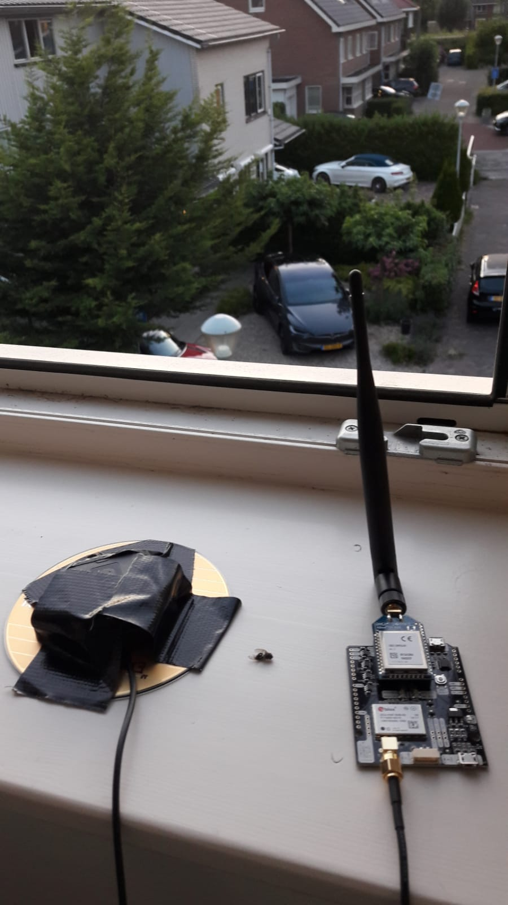
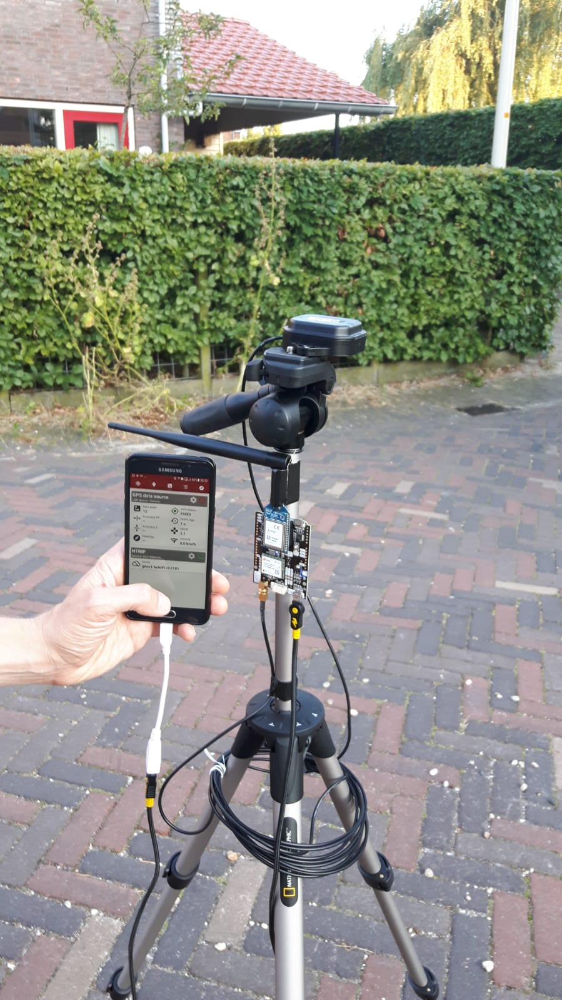
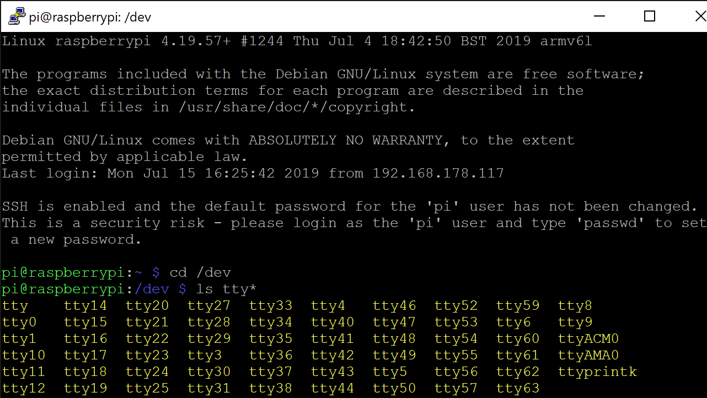

<figure>
  
</figure>

# Ardusimple setup for student projects

This manual is prepared to establish a base station and rover station setup, suitable
for fieldwork for TU Delft students and staff. This setup assumes that
both on rover and base station side, an internet connection (Wi-Fi) is available.
This can be established through for instance a hotspot from a smart phone.

## Materials required:

Basis:
- 2 x Ardusimple dual frequency kits (with ZED-F9P) including antennas (one as base, one as rover). These should in principle be pre-configured.
- 2 x Powerbanks (we recommend 20,000 mAh can be brought on a plane if NOT charged!)
- 2 x data/power cables from micro USB to USB-A

In case you want to use corrections via a server (NTRIP) and internet:
Make sure the Ardusimples are equipped with (male) header pins
- 2 raspberry pi zero W (Rpi0 with header pins)
- 2 SD cards (8Gb or 16Gb)
- 2 additional data/power cables
- 2 On-The-Go (OTG) cables
- 4 female-to-female jumper wires

In case you want to work with Long-Range radio (no internet!):
- 2 XBee radio modules (make sure Ardusimples are equipped with XBEE radio parts)

## Setup with direct LR radio corrections and a smartphone - Android only!

This demonstrates how you can use a direct radio link to collect data, and use your smart phone to collect points. This requires usage of the 2 XBee radio modules that form part of the LR enabled Ardusimple package.

The principle is given in the schematic below.

<<PICTURE>>

### Setting up the base station

The base station is very simple to setup. Make sure that you cover the bottom of the antenna with something that prevents indirect signals coming in preventing multi-path issues. The following connections should be in place
* GNSS antenna in GNSS port
* LR radio antenna in Xbee port
* External power source to POWER+XBEE USB port. Use one of the batteries, or if available a wall outlet. You can also use the USB+GPS port, but you can use this to check the status and available satellites.

IMPORTANT: Position the GNSS antenna on a truly open space and keep it there without any movements! I put it on my rooftop, with no larger buildings in the surroundings. This gave an adequate reception of over 30 satellites. The rover will usually see less, but rover and base should use the overlapping satellites in view to resolve the position with RTK. You can check the amount of satellites by connecting POWER+GPS USB to a Windows computer and use the `u-center` application (not explained here, check the manual of `u-center`). The base station will measure until the standard deviation of error is below 2 meters or so. When that is done, the base station will start to transmit Real Time Correction Messages (RTCM) automatically through the LR Radio. Should take about 10 minutes for this to happen.



### Setting up the rover station

The rover should look like the picture below. I mounted my rover on a typical simple camera rig, preferably you use a right where you can easily control the distance between ground floor and the height of the antenna, so that you know the exact position of the antenna above ground. You can also mount the antenna on your head with a hat and wires for instance, which should give you a pretty reasonable estimate of the elevation if you measure your own height prior to the observation. Make sure the following connections are in place.
* GNSS antenna in GNSS port
* LR radio antenna in Xbee port
* Battery in POWER+XBEE USB port
* Smartphone (Android) to POWER+GPS USB port (in the figure below I only use my smart phone, also to power the unit, but this'll drain your smart phone quickly!)




### Setting up your smart phone to replace internal GPS with the RTK GPS

We want to use the smartphone to do a survey with our favourite survey app. We recommend [OpenDataKit](https://opendatakit.org) (ODK) as you can use this to build your own survey form and use it to observe anything you want to. Within an ODK survey, you can also take Geopoints or Geotraces with your internal GPS. Here we want to do the same but then using the RTK GPS setup just built.

You'll need to do the following to get this done:
* Install GNSS commander from the Google Play Store (free version)
* Start up the application and swipe from left part of screen to right, open settings
* Select GPS data and select USB device as input
* In "Additional Settings" set the USB device to "Generic", Baudrate to 38400 and Forward RTCM data to device to "On"

The RTK GPS should now work and when the rover is in sufficient line of sight with the LR antenna, receive corrections from the base station. It may take a few minutes before a GPS status changes to FIXED, but it shouldn't take very long. If it says "AUTONOM" then there is no RTCM message reception. Perhaps you are too far from the base station to receive these.

If this works appropriately, you can replace the internal GPS location with the location provided by the RTK GPS. For this you need to select GNSS commander as a mock location application (see https://www.xda-developers.com/fake-android-location/ on how to do this) and switch on the "Set GPS mock location" in the GPS data settings in GNSS commander.

Check if you indeed get a very accurate location, by opening Google maps and move the antenna a few cm. You should be able to distinguish this now. If this works, you are ready to do a super-accurate survey with ODK or other survey apps for Android.

## Setup with NTRIP connections with raspberry pis

The principle is as given in the schematic below. The base station is setup such
that it collects Real-Time-Correction Messages (RTCM3) from the base-station Ardusimple. The Rpi0
of the base station retrieves these either via UART or USB from the Ardusimple kit and sends them to an existing Network Transport of RTCM data over IP (NTRIP) caster in the cloud (in this example we use RTK2go.com, which is free for the moment).

The Rpi0 therefore only does one thing: Passing through RTCM3 messages to a caster.

The Rpi0 of the rover also connects to the NTRIP caster and forwards the RTCM3 messages to the rover Ardusimple. The internal RTK engine of the Ardusimple board computes the RTK positions and the Rpi0 collects these in the form of 'NMEA messages'. The Rpi0 does therefore 2 things. Forwarding RTCM from the server to the Ardusimple AND retrieving/logging NMEA messages from the Ardusimple.


### Setup Raspberry PI zeros

Both Raspberry PIs require `raspbian lite`, and a number of libraries. This requires a simple `raspbian` install with a few tweaks, described below.

Repeat this process 2 times:

* Download raspbian lite zip file from the raspbian download pages
* Follow instructions to install it on SD card (e.g. use etcher to get this done)
* Now start up the Rpi0 using the SD card. Preferably have a monitor with mini-HDMI cable and a external keyboard to get the first steps done. When logging in always use user `pi`. When typing a password, use `raspberry` (note: in linux, passwords do not show up on screen! So expect that you don't see anything happening while typing a password, but in the background it will be typed).
* If you want to use the connection scheme with header pins (shown later), then you need to enable those header pins (RX/TX). This gives the benefit that the usb+gps port will remain available for connection with a smart phone. The RX/TX UART connections should be enabled on the Rasp zero. This can be done as follows:
```shell
nano /boot/config.txt
```
You will now be in a simple text editor that can edit this config file. Add (or change) the following setting for UART into the following.
```ini
enable_uart=1
```
* Setup the wireless: if you want to do this from command line, open `/etc/wpa_supplicant/wpa_supplicant.conf` and add a network using examples. You can setup your own network by adding the following lines filling in the missing parts:
```
network={
ssid="<NAME NETWORK>"
psk="<PASS PHRASE>"
key_mgmt=PSA-PSK
}
```
`key_mgmt` is probably not required. For iPhone connection, the `key_mgmt=WPA-PSK` is required.
For fieldwork, the SSID and passphrase (psk) has to be configured according to your mobile Wi-Fi hotspot(s).
* Enable ssh (secure shell) by creating empty ssh file on /boot or using raspi-config. Option 1 can be done by typing:
```shell
echo "" >> /boot/ssh
```
 Option 2 can be done by typing
```shell
sudo raspi-config
```
Now you can disconnect the screen and keyboard, and simply login to the Rpi0 through your favourite ssh connector (on windows: use putty). If you want to know the ip address, type `ip addr` on command line and write down the number in wlan0 after the first occurrence of `inet`. Usually the local ip address looks like 192.168.xxx.xxx. In home networks the first xxx is often 178.

Another way to connect over Wi-Fi is by connecting to the address `raspberrypi.local`. If you are in the same network as the raspberry it should work that way.

* Optional: Another way to remotely connect via USB to the raspberry is by changing two files in the `/boot` partition: In the `config.txt` add the line `dtoverlay=dwc2` at the very end of the file. In the `cmdline.txt` add a space behind the `rootwait` and add the following: `modules-load=dwc2,g_ether`. If you connect a USB cable from your notebook to the raspberry you can now access it via SSH. Note that no internet connection is shared and may just be useful for debugging or compiling purposes.

* Optional, experimental Bluetooth connection for displaying the rover position: There is a good tutorial here: https://scribles.net/setting-up-bluetooth-serial-port-profile-on-raspberry-pi/ where we only have to follow steps 2 and 3. By launching an additional script that listens to hci0 we are able forward NMEA to the virtual bluetooth serial port. A very simple rover Bluetooth script is provided at a later stage in this repository. Another possibility that is still under consideration is the bluedot app (https://bluedot.readthedocs.io/en/latest/index.html).

Now you are ready to access the rasp zero through ssh.

* Get the 2.4.3 branch of RTKLIB (in the past 2.4.3 performed better with ublox data than the master branch 2.42. However, for streaming purposes the master (2.4.2) branch may be sufficient too.) to `/home/pi/` you can get this through typing:
```shell
cd
wget "https://github.com/tomojitakasu/RTKLIB/archive/rtklib_2.4.3.zip"
```
unzip it, move into the right folder and compile and install it as follows:
```shell
cd RTKLIB-rtklib_2.4.3/app
sudo make
sudo make install
```
after that, the package should be ready to install.

TODO: We will supply an image of raspian precompiled libraries that has the package ready-to-use. This skips the previous steps and only the Wi-Fi connection has to be configured with SSID and password.

### Rpi0 - Ardusimple connections

The Ardusimple and Rpi0 can be connected very simply through a USB connection. Then you cannot use a smart phone connection anymore.

The picture below shows what it should look like.

<<PICTURE>>

You can also connect a bunch of header wires as follows, the number coding is
as follows: while looking at the Rpi0 with headers to the top (USB ports on the bottom).

* The first number is the row of header as seen from top to bottom (there are only 2 rows)
* The second number is the column number (left to right).

```
Gnd: pin 1-3
IOREF: pin 2-1
TX1: pin 1-5
RX1: pin 1-3
```

Below, a picture with the connections is shown.

<<PICTURE>>

### Connecting to serial port of Ardusimple

You need to know which device the Ardusimple is. The easiest way to check this out is to go to the `/dev` folder, and type

```shell
ls tty*
```

this will list all devices names with start tty (which is serial port related). Below you see a screenshot. The device with the name ACM0 (USB in this case) or AMA0 / S0 (TX/RX connection) should be what you are looking for. You should try it out to make sure. See the screenshot below.



## First test rover only: stream data from ardusimple to a file

First test if you are able to make some data by positioning the antenna in a nice clear spot near TU Delft campus, and taking correction from the NTRIP caster on the NMI building. The NTRIP caster is referred to in the command below. The application `str2str` streams data from one source and transmits it to another (stream-to-stream). Try the following (assuming your device is called ttyACM0):

```shell
/home/pi/RTKLIB-rtklib_2.4.3/app/str2str/gcc/str2str -in ntrip://gnss1.tudelft.nl:2101/DLF100NLD0 -out serial://ttyACM0:38400
```

If things work as expected, the LED on the Ardusimple saying `NO RTK` should switch off permanently. This means that the ardusimple is receiving RTCM3 messages from the TU Delft server through your Rpi0 and correcting positions with it. The solutions are now real-time computed on the Ardusimple. We however are not yet retrieving these messages and storing these in a file. That is the next step. Open up another ssh connection and type the following command:

```shell
/home/pi/RTKLIB-rtklib_2.4.3/app/str2str/gcc/str2str -in serial://ttyACM0:38400 -out file:///home/pi/rover_test.ubx
```

## Setup your own base station for internet correction streaming purposes

To stream RTCM data to an NTRIP caster (e.g. rtk2go.com), we have to configure the base station to enable RTCM3 messages 1005, 1074, 1084, 1124 and 1230. These must be sent via the port that we selected for this purpose (e.g. for USB). No other message types may be transmitted from that port (no UBX or NMEA. Only RTCM). Note that this way for the base station, no raw data can be logged with only one connection. To overcome this, use soldered header pins to transmit raw data. TODO


## Base-Rover Automatic Transmission

TODO: Autostart is performed via a configured root `crontab`. For this, connect to the raspberry via ssh and type `sudo crontab -e`. Then add at the end of the file the command with the startup script. Note that if you use the supplied Raspberry image for base and rover, you do not need to perform this step.

TODO: Autostart of streaming RTCM to the NTRIP caster (on base raspi) and forwarding RTCM to the rover (on rover raspi). Saving the ublox logged-data on the rover SD card.

## NOTES on u-center configurations (TODO)

Stream -to-stream (str2str) inputs a stream and outputs it elsewhere. Andreas made a script to do just that automatically (startup.sh)

Configure the Base station: use u-center for this.

Check the ZED-F9P integration manual for the steps in more detail.

Under view  messages.

+RXM – RAWX: double click this setting and then click “send” to store the config on the u-blox board.

To store the settings on the permanent storage, make sure to go to CFG – CFG. Here select ALL devices and then click “send” again

Under CFG  PRT select “UART1” to ensure messages go through USB and TX/RX. Protocol in and out should be the same (UBX, NMEA and RTCM3). This ensures all messages are passed through to USB (TX/RX) as is, without any changes.

Selecting the RTCM messages. 1005, 1074 and 1084 and 1124 and 1230 should be enabled. 1005 is the most important one, 1005 is the fixed station location. This position must be “correct” in the sense that it is a pretty accurate position. You cannot double click in this case. All this oncifiguration must be done through CFG  VALSET (see below). This is also all described in the ZED-F9P integration manual for the steps in more detail.

CFG  VALSET. Select Group  CFG-TMODE (to select in which mode receiver should work in). Add CFG-TMODE-MODE to list and set its value to “Fixed mode”. This is the base station mode. If you set it to “survey mode” it will do a 24-hour positioning to acquire the fixed position itself. After this, also add POS_TYPE. We use ECEF (x,y,z) components or lat long. Then add the ECEF_X, Y, Z components  (in cm!) or the lat lon positions dependent on what you chose.

Then also select group CFG-MSGOUT. And select the one ending on 1005_UART1, 1074, 1084, 1124, and 1230 to enable the correct RTCM messages

### Testing with existing NTRIP

Gnss1.tudelft.nl
DLF100NLD0 (RTCM 3.3 messages)

Connecting the rover:
* Connect “Power + GPS” to the normal USB in on pi zero
* Power the rasp zero with the pwr usb.

Stream data from internet to rover.

2.	The command to specify NTRIP as input using str2str is as follows (we use here the delft station with mount point DLF100NLD0):

```shell
./str2str -in ntrip://gnss1.tudelft.nl:2101/DLF100NLD0 -out serial://ttyAMA0:38400.
```

Str2str -in serial://ttyAMA0:38400:8:n:1:off -out serial:// ????
