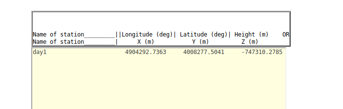
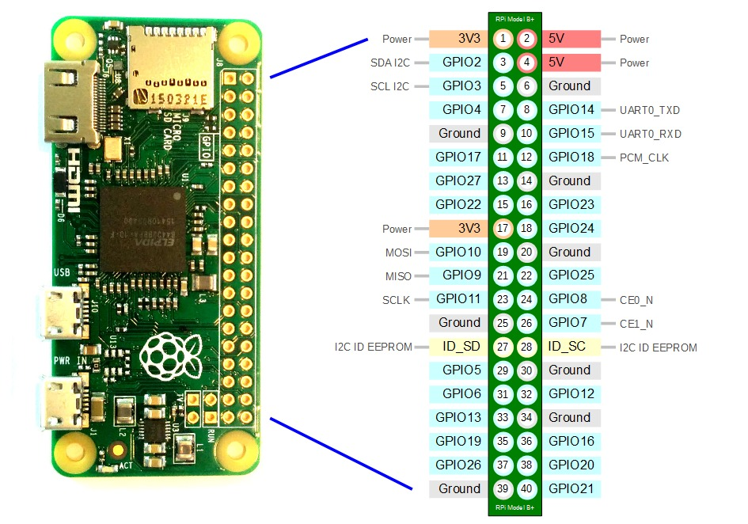
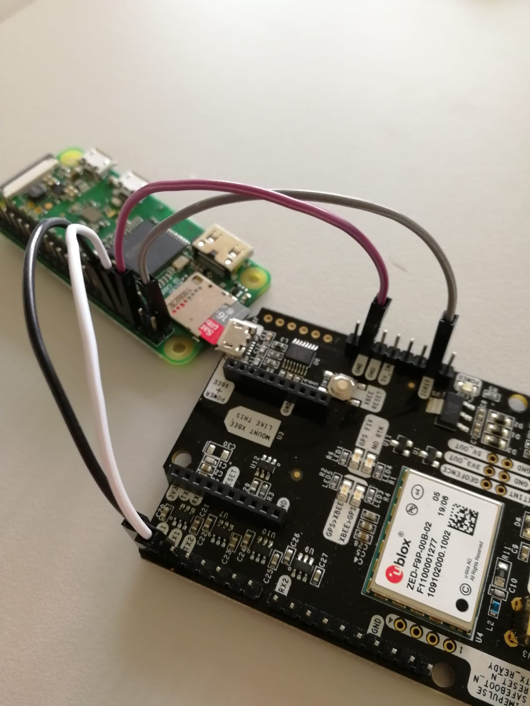

# Positioning Guidelines with the U-blox ZED-F9P GNSS Receiver
Originally written by Andreas Krietemeyer for Humanitarian OpenStreetMap Team Tanzania

### Contributors:
- Andreas Krietemeyer
- Ivan Gayton, ivangayton@gmail.com
- Hessel Winsemius
- Iddy Chazua, iddy.chazua@hotosm.org

# 0) Preface
This document was intentionally set up to log raw (UBX) data with U-blox ZED-F9P receivers and enable the RTK positioning capabilities at the same time. The main part focuses on the configuration of the base station (section 4) and the rover (section 5). The data logging of the raw data (code and phase data) and streaming of RTCM3 messages is generally realized with Raspberry Pi Zeros. Section 5A2 describes the possibility to only use an android smartphone and a receiver, configured as a rover, connected to it to obtain RTK positions. Some practical hints are provided to obtain an RTK solution as well as many troubleshooting tips.

# Contents
1) Software requirements
2) Raw UBX file operations
3) Precise Point Positioning (PPP)
4) Base station
5) Rover
6) Raspberry Pi configuration
7) More practical information
8) Post-Processing in RTKLIB
9) Troubleshooting Raspberry Pi logging

# 1) Software requirements
- [wine](https://www.winehq.org/) (this document basically assumes you are working on Linux, though it's possible to use Windows or MacOS).
- [rtklib 2.4.3](http://www.rtklib.com/)
- [gfzrnx](http://dataservices.gfz-potsdam.de/panmetaworks/showshort.php?id=escidoc:1577894)
- [u-center](https://www.u-blox.com/en/product/u-center)
- [Etcher](https://www.balena.io/etcher/)

## 1A) Wine installation

Virtual environment to execute Windows executables in Linux:

```shell
sudo apt-get install wine-stable
```

https://tecadmin.net/install-wine-on-ubuntu/

## 1B) RTKLIB (convbin) installation

Convbin is converting the raw U-blox binary (.ubx) data from the receiver to RINEX

```shell
git clone https://github.com/tomojitakasu/RTKLIB.git
cd RTKLIB
git checkout rtklib_2.4.3
cd app/convbin/gcc
make
```

While you're at it, you may wish to install `rnx2rtkp`. As of this writing (December 2019) this requires an extra step to compile a dependency, `iers.a`. From within the RTKLIB folder:

```
cd lib/iers/gcc/
make
```

If it demands gfortran:

```shell
sudo apt install gfortran
```

Then go back to the main RTKLIB folder and:

```
cd app/rnx2rtkp/gcc
make
```

## 1C) GFZRNX installation
Does RINEX (GPS Raw data) quality control and data editing / splitting / metadata ...

go to http://semisys.gfz-potsdam.de/semisys/scripts/download/index.php
select the 64 bit or 32 bit linux version that fits to your system. If you're unsure, take the 32 bit version.

That’s it. It’s a binary executable that we need later.

## 1D) u-center installation
*Note: these are Linux-based instructions! If you're on Windows or Mac things will be different.*

Download [u-Blox u-center](https://www.u-blox.com/de/product/u-center). When you get to this page, scroll down a bit until you see the button for "Documentation & resources". There you'll find a section called "Evaluation software" where you can download a zip file.

Yes, it is a windows executable, but we assume you installed wine. Once you download the zip file, extract it. Then go with your command line to that folder and type ```wine u-center_vXX.xx.exe``` (whatever the latest version number is). That will launch a Windows installer.

Go through the installation process, but _don't accept the standard installation path_; that probably won't work (and will be a hassle to find anyway). Put it somewhere on your hard drive that you can remember and easily find.

After installation, navigate again on the command line to where you installed the program and type ```wine u-center.exe```. This will start the u-center application.

You may have to set the permission on the emulated Windows port to access the device via USB. For example, ```sudo chmod 777 ~/.wine/dosdevices/com33```.

## 1E) Flashing images onto SD cards to run on the Raspberry Pi Zero
Etcher flashes saved images to an SD card. It is free, easy to use and validates after finishing.

To download go to [www.balena.io/etcher](www.balena.io/etcher).

You will need this to flash SD cards from the Rover / Base images that are provided.

## 2) Raw UBX file operations
The SD card in our Raspberry Pis stores the U-blox specific binary logging data from the connected receiver. It may consist of NMEA and UBX packages but also RTCM. The UBX data whereas is what we are interested in, because it contains the raw measurements from the receiver (code and phase of the tracked satellites) that can be used for post-processing.

## 2A) Converting raw UBX files

If we have *.ubx logging files with the message UBX-RAWX in it:

We have to convert them to a standard file that is used in GPS Processing. This is the RINEX format.

To convert these, I have prepared a [small python function](https://github.com/hcwinsemius/RTK_GNSS/tree/master/conversion_scripts) that splits, converts and adds metadata.

For this we need the following programs:
- working python3.6+ environment
- gfzrnx
- RTKLIB (convbin)

Open the python script and change the execution paths of convbin and gfzrnx to your location.

Enter the directory where the raw ubx files are located (preferably in an own folder).

Do the same for the rinex and navigation folders. Create a folder for the output RINEX and navigation data is necessary.
These steps have to be performed only once.

To convert the files, we have to define the tasks. Enter the ubx file names that are within the directory that you entered into input files. For each input file, you have to specify a marker name in the next variable.

Edit the metadata for your purpose (use UNKNOWN antenna or the ANN-MB-00 antenna type if you use the small black patch antenna).

Launch the python script. It will create at least one new RINEX file in the rnx_dir specified folder.

The second part will export the stored NMEA messages (as displayed on the Smartphone) but also the High Precision Positioning coordinates (one more decimal point) [XXX - WIP].

## 2B) Resampling UBX files
For PPP purposes the configured 1-second sampling rate is too high. It will not add additional information to the positioning estimation. Instead, the data should be resampled to a much lower sampling rate. The tool gfzrnx that is necessary for the conversion can also do that.

To resample one RINEX file, one has to run this command:

```gfzrnx_lx -finp INPUTFILE -fout ::RX3:: -v -smp 30```

Example:
```gfzrnx_lx -finp HOT100TZN_R_20192400000_01D_01Z_MO.rnx -fout ::RX3:: -v -smp 30```

This will take the input file and resample it with 30 second interval observations. If PPP is performed, always use the resampled data because it is much smaller.

## 2C) Add base station position to RINEX header data
This should be done as soon as a precise location for the base station antenna is available (e.g. after PPP has been performed). It adds this very tiny piece of metadata to the RINEX file that makes it very handy for other applications such as RTKLIB to post-process the data.

For this, use the crux.conf file that is provided.

It looks like this:

```
update_insert:
#————————————-

O - HOT1:
"APPROX POSITION XYZ" : { 0:"4904287.7940", 1:"4008270.3860", 2:"-747306.1630" }
```

To add the approximate XYZ position to the RINEX file, use this:

```shell
./gfzrnx_lx -finp YOUR_RINEX_FILE -fout DESTINATION_FOLDER/::RX3:: -kv -crux crux.conf -f
```

In case you don't have the cartesian coordinates of the point you're trying to use for the crux.conf file, [this NRCAN tool](https://webapp.geod.nrcan.gc.ca/geod/tools-outils/trx.php?locale=en) can do the conversion.

# 3) Precise Point Positioning (PPP)
To be used if:
- long time series (several hours)
- static position (not moving)

Makes it perfect to measure the coordinates for the phase center of the base station antenna.

In short, it applies models and uses more precise satellite clock and ephemeris to get a precise location. Several errors are estimated during that process.

Possibilities to do it are a) to do it ‘on our own’ e.g. RTKLIB or b) using an existing free online service that does this for us. I recommend using an existing online tool because they are powerful, fast and easy to use.

The only thing we have to add, are ocean loading parameters.

These are very important, especially for the height component because we are close (<1000km to the sea).

## 3A) Obtaining ocean loading parameters

For the ocean loading parameters, we need a rough estimation of the position. That can be obtained through

- a) looking up the position in u-center when reading the raw data
- b) perform PPP once without the ocean loading parameters (follow steps in 3B without entering the ocean loading data). If the data is converted correctly this is a very fast possibility.
- c) If the base is already used with its own ‘rough’ position, look up the position on the SNIP caster online: http://69.75.31.235:2101/SNIP::STATUS

Ocean loading parameters can be obtained from [http://holt.oso.chalmers.se/loading/#select](http://holt.oso.chalmers.se/loading/#select)

There one has to select:
- FES2004
- vertical and horizontal displacements
- elastic (Fraell, 1972)
- YES
- NO
- BLQ

Then, remove the content of the text field.

Type the name of the point that is given in the RINEX file (e.g. HOT1). If you don’t know what that means, look up point XXX when converting the raw data – the marker name can be set in the RINEX python script while converting the raw data.

Type the X Y Z or Lon Lat H in the specified columns. Note that you have to separate them accordingly.

e.g. a full example looks like this:

```
sala 11.9264 57.3958 0.0000
```



Enter your email address and click on submit. You will get an email with the Loading parameters.

Once you get the email, copy the content starting with:

```
$$ Ocean loading displacement
until the end:
$$ END TABLE
$$ END TABLE
```

into a new file e.g. TZ.blq and save.

If you already have a station in the TZ.blq (if it already exists from a previous ocean loading run), then copy only the marker entry like this:

```
$$
HOT2
$$ Complete FES2004
```

until before
```$$ END TABLE```

and append it to the file BEFORE the ```$$ END TABLE.```

Save the file again as TZ.blq.

## 3B) Precise Point Positioning (PPP)
I propose to use the [Canadian online tool for this from NRCan:](https://webapp.geod.nrcan.gc.ca/geod/tools-outils/ppp.php?locale=en)

If you don’t have an account, just create one. It’s free.

Log in with your credentials.

Select:
- static
- ITRF
- do NOT add an official marker name
- click on more options and upload your TZ.blq file
- upload your RINEX file
- submit to PPP

You will get an email with the position estimation.

Make sure you save the position summary and/or PDF document because it will be removed from the server after a few days.

You now have a quite good position estimation of your antenna. Be aware that the height especially may still be biased by e.g. a multipath-prone environment (many buildings/trees around etc) or by the low-cost antenna type.

# 4) Base station
The base station is necessary for a differential positioning solution. For Real-time kinematics the base station needs internet access. For post-processing analyses, we only require the raw data.

## 4A) Configuring a base station
Connect the Ardusimple board to your notebook/PC. Note that the micro-USB has to be plugged into the J1 (Power+GPS) port which is on the same side as the antenna plug.

The board should power on now.

Start u-center via wine in the folder where you installed u-center before (see installation instructions on how to install u-center).

The command `wine u-center.exe` will start the program.

Wait until the U-blox logo vanished and connect to the device (typically on COM Port 33) with the button at the third line in the top left (looks like a disconnected plug) and press on the small arrow next to it.

There are two possibilities to configure the base station: Fort RTK purposes (4A1) or for post-processing (4A2).

## 4A1) For RTK purposes
If one wants to use RTK, most importantly the RTCM messages have to be enabled on the USB port of the receiver. No other messages than this may go out.

To configure this:

-go to View-Messages view. A window opens.
- Go to UBX-CFG-MSG (Messages) and select the message: ```F5-05 RTCM3.3 1005```. Activate this one on USB and click on send (bottom left corner).
- Repeat this for the following RTCM3 messages:
  -	1074
  -	1084
  -	1094
  -	1124
  -	1230
- Make sure Make sure under UBX-CFG-PRT (Ports) that the Protocol out on UART1 contains at least UBX and the Baudrate is set according for your needs (e.g. 115200). Click on send.
- After that, go to UBX-CFG-CFG (Configuration)
  - Select all 4 devices on the right (BBR, FLASH, I2C-EEPROM, SPI-FLASH) and click on send.

### 4A1A) Base determines its own position
Quick and dirty. Hence, not very accurate.

- Go to View-Messages view. A window opens.
  - In that window go to UBX-CFG-TMODE3 (Time Mode 3)
  - Click on Mode and select 1 - Survey in
  - Type in the minimum observation time of 120 and required Position accuracy of 2.5. Lowering this value can be done, but the startup (until RTCM becomes available will take significantly longer. Also, this method will never be as accurate as PPP-derived coordinates).
  - Click on Send.
- Go to UBX-CFG-CFG (Configuration). Select all 4 devices on the right (BBR, FLASH, I2C-EEPROM, SPI-FLASH) and click on send.

Now the base station is configured to determine its own position. Since we still want the raw data, this cannot be done via the USB device. Instead we can use UART1 and do the same with jumper cables.

To activate transmission of raw data over UART1 (jumper cables), open the message view again (View-Messages)
- Click on UBX-CFG-MSG (Messages)
  - select the message 02-15 RXM-RAWX and activate it on UART1.
  - Click on send.
- Make sure under UBX-CFG-PRT (Ports) and select UART1 as Target. Check that the Protocol out contains at least UBX and the Baudrate is set according for your needs (e.g. 115200)
- After that, go to UBX-CFG-CFG (Configuration)
- Select all 4 devices on the right (BBR, FLASH, I2C-EEPROM, SPI-FLASH) and click on send.

### 4A1B) Give the base station more precise coordinates
If a good position is inserted here, the rover coordinates will be more accurate than selecting the method from 4A1A.

- Go to View-Messages view. A window opens.
- Go to UBX-CFG-TMODE3 (Time Mode 3)
- Click on Mode and select 2 - Fixed Mode
- Insert XYZ coordinates and the accuracy in meters or Lat/Lon/Altitude Position.
- Click on Send.
- After that, go to UBX-CFG-CFG (Configuration)
- Select all 4 devices on the right (BBR, FLASH, I2C-EEPROM, SPI-FLASH) and click on send.

To check if everything works, investigate if the base station transmits the message 1005 (It contains the base position) by looking at the View-Messages view. If under the point RTCM3 the message 1005 is black, then it is set accordingly. This is however only possible, if the base station antenna is already in the right place and connected to the device at the moment.

We also still want the raw data. As in step 4A1A, this can only be done via the UART1 interface (jumper cables).

To activate transmission of raw data over UART1 (jumper cables), open the message view again (View-Messages)
- Click on UBX-CFG-MSG (Messages)
  - select the message 02-15 RXM-RAWX and activate it on UART1.
  - Click on send.
- Make sure under UBX-CFG-PRT (Ports) that the Protocol out on UART1 contains at least UBX and the Baudrate is set according for your needs (e.g. 115200). Click on send.
- After that, go to UBX-CFG-CFG (Configuration)
- Select all 4 devices on the right (BBR, FLASH, I2C-EEPROM, SPI-FLASH) and click on send.

## 4A2) Post-Processing
Can be done by using 'only the raw data'.

To activate transmission of raw data over USB:
- Open the message view again (View-Messages)
  - Click on UBX-CFG-MSG (Messages)
  - select the message 02-15 RXM-RAWX and activate it on USB.
  - Click on send.
- Make sure under UBX-CFG-PRT (Ports) that the Protocol out on USB contains at least UBX
- After that, go to UBX-CFG-CFG (Configuration)
  - Select all 4 devices on the right (BBR, FLASH, I2C-EEPROM, SPI-FLASH) and click on send.

## 4B) Placing a new base station
Search for a place that is elevated, has clear sky (no obstructions over the horizon), must be safe and preferably re-usable again (the location). Also base and, for your application the rover, should be at about the same elevation (don’t place the base station hundreds of meters higher than your rover). It will decrease tropospheric effects.

### 4B1) For RTK
At the moment, jumper cables are required to log the raw data from UART1. For this we need 5 Female-Female connectors.

Only connect jumper cables if the device is unplugged from the power supply!

Looking at the raspberry pi holding it in front of you with the SD card slot on the top, place all 5 cables on the right side of the header pins from the top. These are:
-	5V
-	5V
-	GROUND
-	TX
-	RX

Connect these to the GNSS receiver:
-	5V_IN
-	IOREF
-	GND
-	RX
-	TX

So it should look like this:
-	5V - 5V_IN
-	5V - IOREF
-	GROUND - GND
-	TX - RX
-	RX - TX





Make really sure that these connections are correct! If these ones are connected wrong, then the GNSS receiver may get destroyed. Note that for GND at the GNSS receiver are two pins. You can use either one of them, but make sure you are not using the ‘empty’ pin on the top.

Set up the station after the configuration in 4A has been performed. After about 24h, retrieve the raw data and [perform PPP with the data](link to relevant section).

Configure the GNSS receiver to use the 'better' position as its own [as described here](4A1B).

We need a wifi internet connection e.g. provided by a hotspot for RTK processing. We have to configure the wifi connection on the SD card (see point XXX).

We have to configure the Base station Mountpoint for streaming to the internet (see point XXX).

Make sure that the Mountpoint (at rtk2go) is set up correctly at http://69.75.31.235:2101/SNIP::STATUS

Be aware that new Mountpoints have to be registered. The registration is simple and can be done [here](http://www.rtk2go.com/new-reservation/)

To make extra sure that raw data is logged, connect to the base station raspberry pi via SSH (if you are in the same wifi network that can be done via `ssh pi@raspberrypi.local` and check if the `base_XXX.ubx` file size is increasing over time. If it's zero or stays the same, something wet wrong. It is probably the wiring. Be aware that the startup may take several minutes.

In the field, a connection to the Raspberry Pi can be made using [Termux](https://termux.com/) which is available [here](https://play.google.com/store/apps/details?id=com.termux) on the Android Play Store.
- Install Termux on your Android device
- Within Termux install OpenSSH by typing `pkg install openssh`
  - On some devices this doesn't work and it suggests to install Dropbear instead; this is fine.
- Turn on your device's Wifi Hotspot
  - The hotspot needs to match the wireless network SSID and password configured on the Raspberry Pi, in our case usually HOT_Rover for both.
- Power the Raspberry Pi and ArduSimple; the Pi should connect to your device's hotspot.
- On the device, go to Settings -> Network & Internet -> Hotspot & tethering. You should see the connected device (probably with username pi).
- Click on the device to see the IP address, which will be something like 192.168.32.xxx
  - In some recent phones such as the Google Pixel 3, the Hotspot system doesn't allow you to see the IP address of the connected devices. To get them, open Termux and type ```ip neigh```, which should display the IP and MAC (hardware) address of all connected devices.
- Open Termux, and type `ssh pi@192.168.43.xxx` (obviously replacing the x's with the relevant digits forming the IP address of the Raspberry Pi).

You then have a very portable field setup to log into the server and investigate problems.

### 4B2) For Post Processing

We only need the logged raw data which is on the SD card. We do not require to overwrite the position on the receiver. This will be done in post-processing via [PPP](relevant link) and/or [in RTKLIB for determining the rover location](relevant link).

Logging of the raw data can be done via UART1 (jumper cables) or USB connection. Preferably over USB because that is more stable.

# 5) Rover

In RTK or Post-Processing Kinematics (PPK), there is always a base and a rover. The base station sends messages to the rover which takes the differences between both points (baseline).

## 5A) Configuring a rover
The rover has to be configured accordingly to log NMEA and UBX packages. They contain position, raw data and navigation messages.

### 5A1) RTK
If RTK is used, we have to configure the receiver to take incoming RTCM messages from USB. To do this:

-connect to the rover via USB and click on View-Messages View. A window opens up.
- Go to UBX-CFG-PRT and select as target USB. Make sure that both, protocol in and protocol out are set as 0+1+5 – UBX+NMEA+RTCM3. If not, select these and click on send in the bottom left of the window.
- Click on UBX-CFG-NMEA (NMEA Protocol), select CFG-NMEA-DATA2 and if it’s not ticked yet, tick High precision mode and click on send.
- Next, go to UBX-CFG-MSG (Messages). Here several messages have to be enabled on USB. Select the message 01-04 NAV-DOP, set the tick at USB and click on send. Repeat this for the following messages:
  - 01-13 NAV-HPPOSECEF
  - 01-14 NAV-HPPOSLLH
  - 01-07 NAV-PVT
  - 01-03 NAV-STATUS
  - 02-15 RXM-RAWX
  - 02-13 RXM-SFRBX
- If that receiver was configured as a base station before:
  - Make sure to disable the TMODE3 setting under UBX-CFG-TMODE3.
  - Disable the RTCM messages 1005, 1074, 1084, 1094, 1124 and 1230 under UBX-CFG-MSG.
    -Under the point UBX-CFG-MSG go to e.g. Message F5-05 RTCM3.3. 1005 and disable it on all ports. Hit send afterwards and repeat it for the other messages (1074, 1084, 1094, 1124 and 1230).

  - After that, go to UBX-CFG-CFG (Configuration)
    - Select all 4 devices on the right (BBR, FLASH, I2C-EEPROM, SPI-FLASH) and click on send.

*Update 30.09.2019:* The Baud rate of the UART1 and USB transmission rate is connected. To avoid missing raw data/NMEA logging on the rover, change the Baud rate of UART1 to e.g. 460800. This should solve the issue of erroneous logging of a survey (see update below 11.10.2019). To change it:
- go to message view - UBX-CFG-PRT and select UART1 as target (should be the default one). Change the baudrate to 460800 and hit send.
- After that, go to UBX-CFG-CFG (Configuration)
- Select all 4 devices on the right (BBR, FLASH, I2C-EEPROM, SPI-FLASH) and click on send.

_Update 11.10.2019:_ Another work around is to use jumper cables. For that we require 3 steps: hardware, ardusimple configuration and startup script modifications. For the hardware step: headers have to be soldered on the ardusimple board. 5 Female-to-Female jumper cables are connected in the same way as for the base station. Connect them like this:
-	5V - 5V_IN
-	5V - IOREF
-	GROUND - GND
-	TX - RX
-	RX - TX

For the ardusimple configuration: Connect the (already as rover configured) ardusimple via USB to your PC and open it via u-center.

Open the Messages view and go to UBX-CFG-PRT (Ports).

- Select UART1 as Target (should be the standard one) and set as Protocol out: UBX+NMEA+RTCM3.
  - Set the Baudrate to 460800. Click on send.
  - Now go to Target USB and set as Protocol out UBX+NMEA+RTCM3. Click on send.
- Next, go to UBX-CFG-MSG (Messages).
  - select the message 02-15-RXM-RAWX and activate it also on UART1. Click on send.
  - Next, go to message 02-13-RXM SFRBX and activate it also on UART1. Click on send.
- After that, go to UBX-CFG-CFG (Configuration)
Select all 4 devices on the right (BBR, FLASH, I2C-EEPROM, SPI-FLASH) and click on send.
Now what is left is the startup script modifications: Insert the SD card into your PC and navigate to /home/pi/. Open the startup.sh and modify both str2str commands. The first one should take ntrip as input (-in) and serial as output (-out). Change the Baudrate of the output to 115200. E.g.:

```-out serial://ttyACM0:115200:8:n:1:off```

The second command takes the input from serial (-in) and output to a file (-out). Change it to e.g. the following command:

```/home/pi/RTKLIB-demo5/app/str2str/gcc/str2str -in serial://ttyS0:460800 -out file:///home/pi/ubx_rover_%Y_%m_%d_%h_%M_%S.ubx::S=24 &```

Save everything and insert the SD card again. It should now log raw data via the jumper cables to the ubx file without interruptions.

### 5A1*) Smartphone connection

To also enable the smartphone connection over the second USB (the side where there is no antenna plug), we have to use one Male-Male jumper cable to bridge TX and RX. This will enable us to use the second USB connection for our smartphone.

Also, we have to do some configuration in u-center.
- Click on view-Message view and a window opens.
- Go to UBX-CFG-PRT (Ports) and select as target UART2.
  - Make sure that the protocol in is none and protocol out is 1 – NMEA.
  - Set the baudrate to 115200. Click on send. After that, go to UBX-CFG-CFG (Configuration)
- Select all 4 devices on the right (BBR, FLASH, I2C-EEPROM, SPI-FLASH) and click on send.

You can now connect with your phone to the rover. Make sure that you select the correct baud rate in PPM/GNSS commander and that you mock your GPS location with the new GNSS position.

### 5A2) RTK with Android and a receiver attached to it
Requirements:
- 1 Ardusimple ZED-F9P board + antenna
- Android phone
- This app [SW Maps](https://play.google.com/store/apps/details?id=np.com.softwel.swmaps)
- one male-to-male jumper cable
- 1 micro USB cable
- 1 USB OTG cable
- (optional) adapter from micro-USB to e.g. USB-C if necessary

I recently discoved a free Andoid app from a Nepalese company that appears to be working very well for a simple-to-use rover application. The idea is to connect a USB cable from the ZED-F9 board to the smartphone and let the app send RTCM messages from the internet (via NTRIP protocol) to the device. The device then returns NMEA strings (actual position) which are interpreted by the app and the position is displayed on the map. It's possible to record single points and trajects with the app but I imagine that's not all that is possible with this app, since it is in principle a mobile GIS. Take a look for yourself [here](https://play.google.com/store/apps/details?id=np.com.softwel.swmaps).

Installing the application is the first step. The second is to prepare your receiver to work correctly. First, one needs a basic rover configuration (make sure that TMODE3 is disabled and that the desired NMEA messages are enabled. These are typically enabled by default.). After that, since we want to use the second USB port on our Ardusimple board, we have to configure UART2 to accept RTCM3 messages and output NMEA:
- Go to UBX-CFG-PRT and select as target UART2. Make sure that protocol in is set to 5 - RTCM3 and protocol out is set as 1 - NMEA. Set the baud rate to the standard baudrate of 115200. If not, select these and click on send in the bottom left of the window.
- Go to UBX-CFG-CFG (Configuration)
  - Select all 4 devices on the right (BBR, FLASH, I2C-EEPROM, SPI-FLASH) and click on send.

Now,disconnect your Ardusimple board from the power source and grab the male-to-male jumper cable. You have to bridge TX and RX on UART2 (which are the second and third pin on the left side of the black female rails). It is written next to it TX and RX. Once that is done, you can connect the second USB port (written as Power+Xbee) to your smartphone. It should power the device and will start up.
Start the app, click on the symbol in the top left and go to USB Serial GPS. Select the device that should pop up on the right side. Select the previously specified baud rate (115200). Now, that's the important step, shose as an instrument model <b>u-blox RTK</b> and NOT <b>u-blox</b>. Only if you select the RTK version, the NTRIP streaming is possible. Click on connect and if your antenna has enough satellites in view, you should already see your 'normal' position. Click on the symbol in the top left again and below Skyplot one should see a new entry 'NTRIP Connection'. Select this one and enter the address and mountpoint details of the NTRIP Caster you wish to use (e.g. rtk2go.com). Do not tick the box to send the GGA string to the caster unless you are using a professional service that allows this option. Click on connect and you should see that data is transmitted. You can check your position under the point GPS Status. There it will display you if a fixed solution is obtained, but also the coloring of the observed points will change if e.g. only a float solution is obtained.

The very first look and the short test I did with it appeared very good. Give it a shot yourself and try it out. With this solution, the 'nasty' Raspberry and bash scripts are not required anymore if one is only interested in a RTK solution provided by the receiver.

### 5A3) Post-Processing

For post-processing we only need the raw data from the UBX-RAWX messages. The data should be logged via USB. To enable the raw data logging:
- Go to View-Messages view. Click on UBX-CFG-MSG (Messages).
  - Select 02-15 RXM-RAWX and enable it on USB. Click on send.
  - Then go to the message 02-13 RXM-SFRBX and enable it on USB. Click on send.
- Go to UBX-CFG-PRT and select as target USB. Make sure that both, protocol in and protocol out are set as 0+1+5 – UBX+NMEA+RTCM3. If not, select these and click on send in the bottom left of the window.
- Go to UBX-CFG-CFG (Configuration)
  - Select all 4 devices on the right (BBR, FLASH, I2C-EEPROM, SPI-FLASH) and click on send.

The rover is now sending raw data (code and phase) and navigation data via the USB port.

## 5B) Placing a rover

Because in RTK or PPK the processing works in such a way that atmospheric effects are considered the same over both locations, if the rover is within 1km of the base this can be considered true. However, the further one moves away (or significantly higher altitude) this error is increasing and affects especially the height component. I cannot give a guarantee on this, but my feeling is that if the base-rover setup is approximately within 5 km, the processing should still be fine. The further one gets away from the base station the more difficult it gets to solve the ambiguities (getting a ‘fix’) and the higher the error gets.

Also, multipath should always be considered (more importantly for the base station though). A metal plane (1mm thick is even enough) with a 10 cm diameter is recommended if the small black patch antenna is used (ANN-MB-00). Clear sky can improve the position estimation significantly.

The logging period should also be as long as time permits. In theory after startup the receiver is able to compute a location within the first 3-4 minutes. However, the longer the observation time, the easier it is to get to a static position,

if post-processing is required. If you’re not logging data on your phone (e.g. ODK), I recommend to place the receiver according to the stated requirements (e.g. on a metal plane on top of the measurement point), connect the power to it and leave it there for at least 5 minutes, preferably longer, maybe 20 minutes for the beginning just to be sure. Doing it like this will create one file for each observation point.

## 5C) Positioning export from a rover ubx file (trajectory)
If a RTK survey has been performed, one can read the positioning data from the recorded data.

- Open u-center with wine and open the .ubx file.
- Press on the green play button and move the slider to the last entry (it will run through).
- Open View - Table View and click on the black “+” symbol.
  - Search for lat and click on Lat, Position LTP Latitude. Press ok.
  - Repeat that for lon, Reference Carrier Range Status, Alt (HAE), Alt (MSL) and UTC.
- To export the data to a csv file, select all table entries by mouse or press CRTL-A and right click to export as csv. You can now load the data into a GIS or select the time steps you want to derive e.g. the mean from it.

#### About the column names:
The Reference Carrier Range Status indicates the positioning status (0->Stand-alone, 1->Float, 2->Fix). So you should always aim for the fix solution if you want to get an accurate position. Remember that Alt HAE is the height above ellipsoid and Alt MSL the mean sea level height.

# 6) Raspberry Pi configuration

## 6A) Using Balena Etcher
I provide two images (.img files) that contain already pre-compiled and pre-configured programs. These images can be flashed onto an SD card of 16GB or larger. If the SD card is too small (some supposedly 16GB SD cards are actually just a bit smaller) the image file can be shrunk [like so](https://softwarebakery.com//shrinking-images-on-linux).

They can also be downloaded here:

https://drive.google.com/file/d/1UYbVYiMwYUqnRdEPbzlsimrnmca3Tv7i/view?usp=drivesdk

https://drive.google.com/file/d/1yT-SbK4NyZC3jYns5vAydWEiDHTorPH2/view?usp=drivesdk

If one wishes to flash another empty SD card as a base or rover, one can use the provided images. For this I recommend the program Etcher. One only has to select an image and the SD card as target. It will create two new ‘partitions’ on the SD card (bootfs and rootfs).

## 6B) Using dd (Disk Dump)

Before inserting the SD card into the reader, run the following command to find out which disks are currently mounted:

```
df -h
```

Which will return something like this:
```
Filesystem 1K-blocks Used Available Use% Mounted on
rootfs 29834204 15679020 12892692 55% /
/dev/root 29834204 15679020 12892692 55% /
devtmpfs 437856 0 437856 0% /dev
tmpfs 88432 284 88148 1% /run
tmpfs 5120 0 5120 0% /run/lock
tmpfs 176860 0 176860 0% /run/shm
/dev/mmcblk0p1 57288 14752 42536 26% /boot
```

Insert the SD card into the reader and type `df -h` again:

```
Filesystem 1K-blocks Used Available Use% Mounted on
rootfs 29834204 15679020 12892692 55% /
/dev/root 29834204 15679020 12892692 55% /
devtmpfs 437856 0 437856 0% /dev
tmpfs 88432 284 88148 1% /run
tmpfs 5120 0 5120 0% /run/lock
tmpfs 176860 0 176860 0% /run/shm
/dev/mmcblk0p1 57288 14752 42536 26% /boot
/dev/sda5 57288 9920 47368 18% /media/boot
/dev/sda6 6420000 2549088 3526652 42% /media/41cd5baa-7a62-4706-b8e8-02c43ccee8d9
```

The new device that wasn't there last time is your SD card.

The left column gives the device name of your SD card, and will look like or '/dev/sdb1'. The last part ('p1' or '1') is the partition number, but you want to use the whole SD card, so you need to remove that part from the name leaving something like '/dev/sdb' as the disk you want to read from.

To backup your SD card:

```
sudo dd if=/dev/sdb of=~/SDCardBackup.img
```

The dd command does not show any feedback so you just need to wait until the command prompt re-appears.

To restore the image, do exactly the same again to discover which device is your SD card.  As with the Mac, you need to unmount it first, but this time you need to use the partition number as well (the 'p1' or '1' after the device name).  If there is more than one partition on the device, you will need to repeat the umount command for all partition numbers.  For example, if the df -h shows that there are two partitions on the SD card, you will need to unmount both of them:

```
sudo umount /dev/sdb1
sudo umount /dev/sdb2
```

Now you are able to write the original image to the SD drive:

```
sudo dd bs=4M if=~/SDCardBackup.img of=/dev/sdb
```

The bs=4M option sets the 'block size' on the SD card to 4Meg.  If you get any warnings, then change this to 1M instead, but that will take a little longer to write.

Again, wait while it completes.  Before ejecting the SD card, make sure that your Linux PC has completed writing to it using the command:

```
sudo sync
```

## 6C) Other configurations on the image

The provided images work in a way that data logging is started automatically about 3 minutes after the power has been turned on.

As a standard, I configured HOT_Rover (password HOT_Rover) for the rover and HOT_Base (password HOT_Base) as wifi point. This can be changed.

Also, streaming is disabled by default because the mountpoint has to be set accordingly. It may only give one mountpoint at the same time.

The only things that need to be adjusted are Wifi connection, baud rate (if changed) and the mountpoint for real time streaming of RTCM data.

To change the wifi connection, change the ssid and pswd lines in the rootfs partition under ```.../etc/wpa_supplicant/wpa_supplicant.conf```

## 6A) Base station raw data logging

The baud rate is especially important for the base station logging. As standard, 38400 is selected. If however, this has been changed in the u-center configuration, one has to change it on the SD card of the base station as well. This can be done under the rootfs partion under ```/home/pi/startup.sh```. There change the two lines that state ```-in serial://ttyS0:38400:8:n:1:off -out``` and ```-in serial://ttyS0:38400:8:n:1:off -out``` with 38400 as configured baud rate to your baud rate that was set in the receiver (e.g. 115200).

## 6B) Base station RTCM streaming

Insert the base SD card. In the rootfs partition under ```/home/pi/startup.sh``` the 4th line of code is commented (marked with an # at the beginning). To enable realtime streaming make sure that ONLY RTCM3 is retrieved from the USB connection. Remove the # at the beginning of the line and change the mointpoint name to a unique one that is not active at the moment (HOT_TEST_001 is the mointpoint name). Beware that HOT_TZ_001 is already in use and cannot be taken twice.

## 6C) Rover receiving RTCM stream

Insert the rover SD card. In the rootfs partition under ```/home/pi/startup.sh``` the 4th line of code is commented (marked with an at the beginning). To enable realtime receiving of RTCM messages make sure that the correct mointpoint is specified in that line (HOT_TEST_001 is the mointpoint name). Change that to your base station mountpoint and uncomment (remove the # at the line) the command. If the wifi is setup correctly it will now retrieve the RTCM messages from the base station in real time over the internet.

## 6D) Rover raw data logging for post-processing
Is activated automatically in the Rover SD cards / images that are provided. It assumes that the rover receiver is configured correctly and connected via the Power+USB port.

# 7) More practical information

## Hints for accuracy
- For precise applications it is very important that the base station position is determined carefully (e.g. by PPP – see section 3) and set to fixed mode in the u-center application (see section 4A1B).
- The closer the rover is to the base station, the easier it is to get a ‘fixed’ solution and the smaller the error caused by tropospheric effects is (i.e. water vapor in the atmosphere).
- Use a tripod to place base and rover.
- If the small black patch antenna is used (ANN-MB-00), use a circular 10 cm diameter metal ground plane and place the antenna in the middle of it. This will improve the results noticeably.
- Be aware of canopy or other objects close to your antenna. To ensure best results, always place the base antenna in a clear-sky area. If the base antenna is partially covered, no precise positions can be obtained. This also applies to the rover, can however, be mitigated partially with a longer observation period (if the multipath effect is not too severe).
- Plan ahead for RTK.
  - If you want to place a new base station for your survey, look for a suitable location (see also section 4B) close to your area of interest (preferably below 5km) that is accessible and has a clear-sky environment.
  - I recommend to place the base station for one day if possible (8 hours should work too) and log the raw data. Mark the location and measure the height of the antenna. Download the raw data, convert it, perform PPP (see section 3) and set the location of the base station to ‘fixed mode’ (see section 4A1B).
  - Then place the base antenna at exactly the same height/position and check the datastream, if the RTCM3 1005 message is transmitted. If it is, then you can start your rover measurements in RTK.
- Base station antennas are sensitive to multipath and shadowing. Suggestion is to mount antennas at least 2-4 meters above surrounding obstacles with a metal pole and fix the pole with wire ropes. This will increase the usability of the base station. Of course the PPP must be done after the base station is placed in this way.

# 8) Post-Processing in RTKLIB
For this task, I prefer to use not the 'original' RTKLIB version, but one that is forked from the original one which is more targeted towards low-cost receiver processing: [rtklibexplorer](https://github.com/rtklibexplorer/RTKLIB). Compilation of the code is exactly the same as for the 'normal' RTKLIB version. There are however, also Windows binaries available from the [website](https://rtkexplorer.com/downloads/rtklib-code/) of the developer.

Since the GUI is much more comfortable to work with, I prefer to use wine again and the precompiled Windows version of the developer. However, a short description, how to compile the source code is given further below. So download the latest Windows version from the developer's website, extract the files and navigate to the folder via command line. Now start the program via wine:

```
wine rtkpost.exe
```

And a GUI should open up. A lot of explanations could be given here. However, you will only find an example application here.

The manual for RTKLIB is [here](http://www.rtklib.com/prog/manual_2.4.2.pdf) and the section on rnx2rtkp begins on page 93 at time of writing. For convenience, we've put a copy of the relevant section [here](rnx2rtkp_manual_extract.md)

Requirements for post-processing:
- raw data (Code and Phase data) of base and rover in RINEX format
- MGEX broadcast navigation data
- some some configuration

All requirements will be discussed below.

## Raw data of base and rover

One needs the raw data of both, the base and rover. The data is in the RINEX format and preferably split into daily files. However, if the recorded data of base and rover are not too long, this might not be necessary. However, both datasets (obviously) have to cover the same time period that is desired from the rover dataset.

This section gives a quick description on how to convert the logged .ubx files of base and rover to RINEX files. It does not cover how to convert it to daily files.

For the conversion we use the command line tool convbin. Section 1B) covers the installation procedure. Navigate to the convbin folder, set an alias or put a link for it into your bin folder. For one ubx file that you want to convert, use the following command line code:

```
convbin -os -od -f 5 -v 3.03 YOUR_UBX_FILE_PATH
```

This will convert the logged data one-to-one into RINEX. No splicing, no trimming or splitting is performed. It will output you a .obs file. For further processing, the supplied python scripts can be used, or manually with [gfzrnx](http://semisys.gfz-potsdam.de/semisys/scripts/download/index.php).


## MGEX broadcast navigation data

The navigation data can be A) logged by the U-blox chip directly (if the message SFRBX is enabled) from the observed satellites or B) just downloaded from the internet. The broadcasted information is the same whether it is downloaded or directly logged by the chip. You only need to know which day of the year (DOY) you recorded your data. You can check that e.g. [here](https://www.esrl.noaa.gov/gmd/grad/neubrew/Calendar.jsp).

Once you know your year (which should not impose a big problem I hope :) and DOY, you can go to NASA's archive of Space Geodesy data (CDDIS) and download the MGEX file from here:

```
ftp://cddis.nasa.gov/gnss/data/campaign/mgex/daily/rinex3/
```

Navigate to the year and DOY. Then there are several folders which the two-digit year number (e.g. 19) and one letter behind. For year 2019 DOY 205 e.g. select 19p and download the brdm2050.19p.Z file. The full link looks like this: ftp://cddis.nasa.gov/gnss/data/campaign/mgex/daily/rinex3/2019/205/19p/brdm2050.19p.Z

Extract the file and keep the location in mind or copy it to a destination that you prefer.

## Example Configuration

Once you are in the RTKPOST GUI, enter the file path of your rover in the first box (RINEX OBS: Rover). Below, anter the file path of your base (RINEX OBS: Base Station). Below that, enter the file path of the MGEX brdm file that you just downloaded. The other boxes below it can stay empty. At the very last box on the bottom, enter the output file location.

Now, for the 'specific' configuration, download the example configuration from [here](example_configuration/rtkpost.conf). Once you downloaded the example configuration, click on 'Options...', click on 'Load...' and select the .conf that you just downloaded. On this page, you should see that GPS, GO, Galileo and BeiDou should be activated and the frequencies L1+L2 are selected, as well as the Positioning Mode Kinematic. If you know that your rover position is static from start until finish, you could also select 'Static' as the positioning mode here. Click on Ok and you could execute the processing.

It should create a .pos file at the specified directory.

## (Optional) Compilation of source code

The equivalent to the rtkpost.exe GUI is the rnx2rtkp application (which is a command-line interface). To compile the rnx2rtkp applicatio, navigate in the command line to the RTKLIB folder and:

```
cd app/rnx2rtkp/gcc
make
```
if you see `iers.a` does not exist, then

```shell
sudo apt-get install gfortran
```

try to make the `rnx2rtkp` again.

If that does not work:

```shell
cd RTKLIB/lib/iers/gcc
make
```

This process will take some minutes. It will create an executable which is a command line application. It takes RINEX observations (rover and base) and navigation data to compute rover positions.

## (Optional) Instructions TZN-specific

To download base station data, connect via SSH to the Raspberry PI (base station) and locate the file(s) that you are interested in. The standard password for the user pi is raspberry.

You can find the IP addresses of the connected devices in the router configuration.

Copy the filename of the respective base station log file. To download the data, type

```
scp pi@192.168.100.247:/home/pi/FILENAME.ubx /home/hot-admin/Documents/RTK/Data/ubx/TARGETFILE.ubx
```

Convert the base station data and rover data with the [python script](conversion_scripts/main.py). Add the base station position to the RINEX base data (see section 2C). Make sure that navigation data (under ../nav/) has been created by the rover.

## (Optional) Command-line rnx2rtkp options

The configuration itself is done via command line arguments and requires some insight to the application. In principle for a base-rover setup there are two positioning modes that we can choose from: a kinematic solution (if the rover is moving) and a static solution (if the rover is not moving). Beware that if you select a static solution, the full RINEX rover observation data must be from the same point, so it may not move. The only difference between both solution modes is that the estimated rover position will be tightly constrained in the static solution but loose in the kinematic solution.

There are different methods to solve for the integer ambiguities in general (obtaining a ‘fixed’ solution). For a static solution, I definitely recommend the fix-and-hold integer ambiguity resolution, though the results on a kinematic solution may be acceptable too. There are more options, but the second option that one could try is the continuous ambiguity resolution. The performance is typically measured with the amount of fixed solutions in the data. Personally, the fix-and-hold solution performed best for my cases.

One example configuration:

```
./rnx2rtkp -o output.pos  -p 3 -m 5 -h -y 2 -sys G -t -c -s , rover.rnx base.rnx rover.nav
```

This will output the positions into output.pos. ```-p 2``` means would be kinematic, ```-p 3``` is static (rover is not moving, a single point only), ```-m 5``` elevation cutoff at 5 degrees (we discard all data below 5 degrees), ```-h``` means fix-and-hold ambiguity resolution, ```-y 2``` means to output the residuals, ```-sys G``` means GPS-only satellites (you would use ```-sys G,R,E,C``` to use all systems), ```-t``` sets the time format to yyy/mm/dd hh:mm:ss.ss, ```-c``` means a combined kalman filter is used (forward and backward).

It requires however, that the base position is set in the base RINEX header. See section XXX. If it is not, we have to supply it separately e.g. in lat lon h with the option

-l <latitude> <longitude> <height>

Things that can be changed in this configuration are:
-p 	to 	-p 3
-m	to	-m 10
-h	to 	(can be removed) – it will use a continuous ambiguity resolution instead
-sys	to	-sys G,R,E,C

# 9) Troubleshooting Raspberry Pi logging
If the base station is not logging data correctly, the first thing to check is that the wiring is correct.

#### Base does not log data (*.ubx files):

If the data is still not logged afterwards, remotely connect via SSH to the Raspberry Pi

E.g. via the IP address, or by `ssh pi@raspberrypi.local`

Check if the latest .ubx file size is increasing over time (e.g. via repeating `ls -al` and checking the file size manually). If the file size is increasing, the data is probably logged correctly. If it does not, then check the running processes with `ps -aux`.

There should be two processes from str2str. One that streams the data to the ntrip and the other one that logs the data into a file. If there is only one process from str2str, it means that the UART interface was probably not found correctly. This typically means that the wiring is not correctly set up. Type ```ls /dev/tty``` and press tab twice times to see if ttyS0 is there. If not, UART1 (TX, RX) is not found. The wiring is probably the problem or UART1 is not active on the raspberry pi (enable_uart=1 in config.txt on the boot partition).

If ttyS0 is there, the automatic logging stream did not start. This may happen if the raspberry device is turned on before the antenna could capture any satellite data. If the antenna is in more or less clear-sky environment this should be however not the case. Instead it may be that the internal voltage is not correctly set up (check the IOREF and 5V_IN pins).

To start the logging manually, copy the file-logging part from the startup script and execute it in the command line (but remember to remove the ‘&’ at the end). Monitor the output from it. If in both columns (data-in and data-out) there are quite big numbers, the logging works. If that is the case, you can end the process again and restart it with the ‘&’ at the end. The process should now work in the background. You can check again if the file size is increasing or not with `ls -al`.

To hook upon a running stream (e.g. to check out the running str2str process), locate the PID via ps -aux and hook upon the stream via

```
sudo tail -f /proc/PID/fd/1
```

#### Register your base station at rtk2go:

Bear in mind that from now on every new mountpoint has to be registered on their website. So if you have two base stations running simultaneously, then both need a registration on their website (http://www.rtk2go.com/new-reservation/)
After max. ~8hours (they claim) to send a password to you via email.

#### Base does not stream data to rtk2go:

Check the cabling and USB connections. Remember that the OTG cable has to be plugged into the USB slot where the antenna cable is on the ardusimple board.
For troubleshooting, connect via SSH to the Raspberry Pi.

To check if streaming / logging are running on the raspberry, type `ps -aux | grep str2str`. If there are two programs from str2str running (must be 3 lines in total then), it means that the script at least tries to send the data.

Now it is recommended to check what’s going on with the streaming. For that hook on to the output of the stream via the process ID that you can see from the ps -aux command (the number on the left): ```sudo tail -f /proc/XXX/fd/1``` Where XXX is the process number.

Check if the messages on the right are between ~2000bps and ~5000bps meaning that RTCM are probably sent from the receiver to the raspberry. If not, check the configuration of the ardusimple.

If that is the case and the stream is not running online, then it will probably state something like rtcv error. It’s likely that your password is not configured correctly. Check the startup script. Typically that is the `startup.sh`, but check with `sudo crontab -l` which scripts are executed on startup. For example, it may be `base.sh` and `base_logging.sh`, So you’d have to configure the `base.sh` for streaming and adjust the mountpoint name and password there.

Before you restart the stream, end the current streaming attempt by killing it with ```sudo kill XXX``` where XXX is the process number found from the ps -aux command.

To restart the stream manually, copy the command and leave the ‘&’ out at the end. Type a sudo before the command and hit enter.

It will restart the stream. Monitor if the stream is up again and if you are satisfied, end the stream with <kbd>CTRL-C</kbd> and restart it in the background. To do this, use the same command as before and add the ‘&’ at the end.

Now you can close the SSH session by just hitting the ‘x’ of the terminal window. It will give you a warning but that is okay for now. Check online if your stream is still there.

# 10) Other resources
[This explanatory video](https://www.youtube.com/watch?v=R0Hry5kR1jY) provides a lot of information about how Real Time Kinematic (RTK) and differential correction work.
