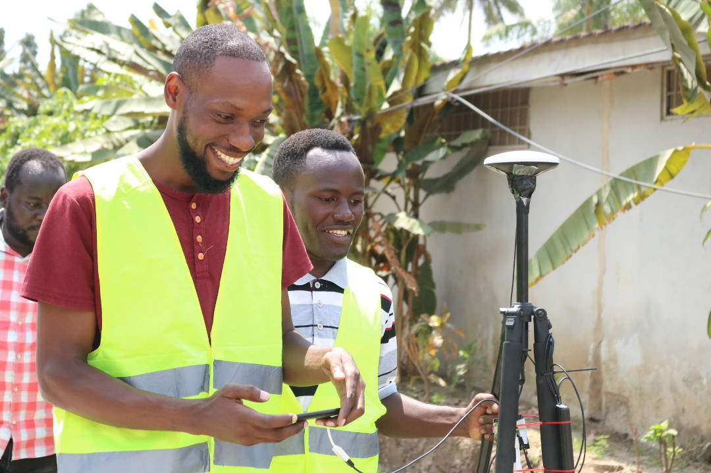

# High-Precision GNSS Surveying with Low-Cost Devices

Instructions, resources, and code for high-precision GNSS surveying with low-cost devices. For the moment focusing on the use of the [uBlox ZED-F9P receiver](https://www.u-blox.com/en/product/zed-f9p-module).

We currently have two different documents with instructions to get started (these will be merged over time).

[A basic guide for student projects](Ardusimple_setup_for_student_projects.md)

[A detailed (work-in-progress) guideline for developers](Positioning_guideline.md)

